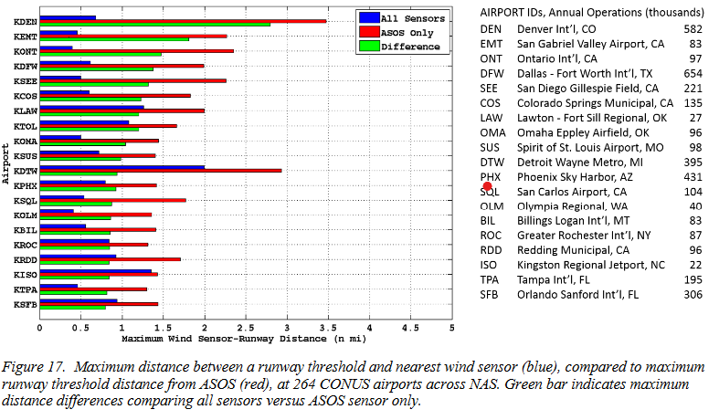

# ai_case_repository
This is the AI bootcamp Challenge Assignment One

## Overview and Origin

The company I selected for this exercise is Searidge Technologies.  Searidge develops software serving the aviation industry, specifically air traffic control towers.   Personally, I’m somewhat of an aviation buff.  Still undecided at the time on what area I wanted to write about, I was watching a TV program, which I watch frequently on the Smithsonian Channel, called Air Disasters. https://www.youtube.com/watch?v=qM4O16Xv8Gc

 This program is a documentary that delves into the investigation of plane crashes by the National Transportation Safety Board (NTSB) and other similar agencies throughout the world depending on the jurisdiction where the crash occurred. 
https://www.ntsb.gov/about/history/Pages/default.aspx
The investigations (re-enacted on the program Air Disasters) involve crashes primarily of those relating to airlines. Usually the NTSB identifies the cause(s) of the crash, and upon doing so, makes recommendations in it’s review to the Federal Aviation Administration (FAA) on the means to avoid another such crash in the future. 

Without digressing any further, the particular instance of Air Disasters I was watching, dealt with a crash involving a Continental Airline flight 1404 departing from Denver International Airport (DIA), on December 20, 2008 headed for Houston, TX. (https://en.wikipedia.org/wiki/Continental_Airlines_Flight_1404).   

This incident hit close to home, since DIA is my home airport.  I’m a resident of the Denver area.  I do recall the incident being reported in the news, so it piqued my interest.   The program’s re-enactment of the investigation showed the plane during take-off and just prior to lift off, turned sharply left and slid off the runway.  Fortunately, there were no deaths.  Also depicted during the program, the NTSB had a mock layout of the airport showing where all the weather towers were that had been collecting wind speeds.  It was suspected and finally concluded that the cause of the accident was due to a cross-wind gust of 31 knots that pushed the plane off the runway, and later added that the crew did not adjust for the conditions.  Fault was also attributed to the Air Traffic Control (ATC) system that reports only average wind speeds to the pilots (not gusts).  
That last bit of blame here if you will, where ATC reports only the average wind speeds to pilots, is what led me to ask the question, “how could AI have played a part in this and potentially prevented the accident?”  My thinking on the subject is 1) there are many weather towers at the airport collecting wind speeds, as I saw this on the program, 2) having over loaded ATC controllers relay this information to pilots seemed inefficient to me, and 3) in this case, the information relayed was not sufficient.  A potential AI solution would be to collect all the wind data across the airport, and relay maximum gust information over the last 10 seconds, directly to the pilots (upon request), thus relieving ATC from being the middleman of the information.  Pilots therefore would have the most updated and pertinent information available to them, and avoid potential human error during the relay.  Likewise, a side benefit would be the reduction (although small) in workload for ATC.

 Part of my reseasrch involved indentifying what issues there might be in the commercial aviation industry when it comes to the collection of wind data, and the disemination of it to pilots.  I came across an analysis, Airport Wind Observation Architectural Analysis, produced by the Massachusetts Institute of Technology (MIT) on behalf of the Department of Transportation, Federal Aviation Adminstration, on contract through the US Air Force.  The report date was July 10,2018.
The Executive Summary explains why the report was requested and produced.  I've included it below for ease of consumption and a [link](https://apps.dtic.mil/sti/pdfs/AD1128600.pdf), to view the entire report (pdf).  I encourage one to read the analysis, as I found it quite informative, which highlights my perception of the gaps that exist today in reporting and consuming wind information relating to the aviation industry.  There were 10 shortfalls identified in the analysis, and 10 corresponding recommendations. I will not list them all here, but rather extrapolate the couple that apply to this case. 

                             Executive Summary (from)
                 Airport Wind Observation Architectural Analysis

"Wind information is a critical element for ensuring safe aviation operations, particularly while
performing low altitude takeoff and landing procedures. Across the National Airspace System (NAS), supporting wind observations are currently collected across a multitude of different sensor platforms whose configuration varies substantially from airport to airport, largely dependent upon airport physical size, traffic volume, and hazardous wind shear exposure. For more than a decade, chronic concerns from air traffic controllers and pilots have emerged regarding the consistency and reliability of wind information at a number of locations.
The analysis presented here identifies potential shortfalls in the current wind information architecture, and offers recommendations for improvements that would serve the Federal Aviation Administration (FAA) in the context of Next-Generation Air Transportation System (NextGen) enabled concepts. The methodology relied on interviews and discussions with stakeholders, review of existing problem reports and operational logs, search and review of documentation related to wind sensors and operational policy, and analysis of airport wind sensor data."

                                (End of Summary)

One glaring aspect, particularly in the Continental Flight 1404 case, are the wind speeds reported by ATC, and specifically by DENver ATC pertaining to the discrepancies between the two observation points.  Denver is at the top of the list.  This (as shown) from figure 17 of the report (page 47), depicts the wind speeds obtained from an Automated Surface Observing System (ASOS) sensor (red), and that of the nearest wind sensor (blue), as measured from a runway threshold. This leads to discrepancies being reported to pilots (green on the graph) and as expressed in shortfalls #8 & 9 of the report....

"Shortfall #8: Wind report for runway threshold may not be representative due to spatial translation from observation location."

"Shortfall #9: Multiple wind source options for communicating wind to pilots relies on discretion of controller in selecting representative wind. Pilots are not currently made aware of wind information source."

"Shortfall #10: A formal process for collecting, prioritizing, and resolving wind observation issues is not in place."

In my opinion, this presents an opportunity to setup a system deploying AI to address all three of these shortfalls, as well as other shortfalls within the report not listed here.   

With this use case in mind, I was inspired to research to determine if any companies might exist that may be offering such an AI based product.  This search is what led me to Searidge Technologies.  As mentioned earlier, Searidge develops software for the automation of air traffic control towers.  It was founded in 2006 by Moodie Cheikh and Alex Sauriol, and was headquartered in Ottawa, Canada (initially in an Ottawa west-end coffee shop).  
https://searidgetech.com/our-story/

In the beginning, both founders were looking for an industry to automate and toiled over what they wanted to focus their efforts on.  On Searidge’s website, is a published interview with CEO Moodie Cheikh (https://www.nats.aero/news/elevate/april-22/crossing-the-chasm-how-digital-towers-joined-the-mainstream/) where he states...
 “We kept throwing ideas around. Alex had done some work in the aviation sector and we were struck by how little technology there was in use, and what there was had evolved very little in over the decades.”  
Shortly after the 9-11 attacks with air travel rebounding, the founders felt it was a “perfect market to disrupt”, and launched Searidge Technologies.  

## Business Activities

The interview goes on and describes the areas in which they wanted to address.  Initially the pair drove a self-funded proof of concept (POC) where they married (at the time) an emerging technology of digital cameras, to monitor and capture airport surface ways such as runways, taxiways, aprons, and gates.  Digital cameras could be placed throughout the airport, along taxi strips, runways, and any other surface area to be included in the monitoring and displayed in the control towers.  These are the areas where an airport is limited in its growth when capacity approaches saturation. They surmised that this is where technology can offer true value by running more efficient by “knowing’ where everything is at any given time, in real time (think aircraft runway hold lines awaiting clearance before proceeding across oncoming traffic ways), and assist ATC by providing critical information 24x7. This POC was tested in partnership with the Ottawa airport.

Following the POC roughly during the 2007-2008 timeframe, the pair took the results on the road.  They ran into a lot of skepticism from the industry during trade shows, but their first taste of success came when a video was produced demonstrating the capability in a real-world application in Abu Dhabi.  This led to an investment by the Canadian Air Navigational Service Provider (ANSP) in 2010 for an undisclosed amount.  This investment essentially set the company up for further success.  Based on this, they went on to develop the “digital tower” thus enabling the “remote tower” where controllers can monitor the airport without even being at the airport.  The capability also enables for a backup tower to exist as well if desired. The products developed by Searidge and their features, as listed on their website, are:

#### Searidge Platform  
    https://searidgetech.com/searidge-platform/

The digital technology platform for which they build everything up from.  It supports containerization for Cloud, virtualization, handles security, and contains API (application programming interface) based communication, permitting 3rd party development. URLs are provided for further information on each product. 

#### Airport Surface Display
    https://searidgetech.com/airport-surface-display/

    •	Integration of multiple data sources into an intuitive map display
    •	Multiple display filters and user-customization options
    •	Precise aircraft and vehicle positional data in the air and on the ground
    •	Real-time weather and NOTAM updates
    •	User configurable alerts
    •	Easy-to-install ADS-B receivers and vehicle transponders
    •	Small form-factor devices for quick and easy installations

#### Enhanced Airport Vision Display
    https://searidgetech.com/enhanced-airport-vision-display-eavd/

    •	Proven user display technology
    •	Easily integrated with external systems
    •	Proprietary stitching technology
    •	Used at regional, national and international airports around the world

#### AIMEE: AI Framework
     https://searidgetech.com/aimee/

    •	The algorithm is learned, not designed
    •	Non-technical users can develop AI solutions
    •	Output confidence is provided
    •	Noise resilience by design
    •	Potential to speed up system development
    •	Recognizes patterns in enormous amounts of data at speeds that greatly surpass human   capabilities
    •	Ability to simultaneously process data from different sources such as video sensors, ATC radio, ADS-B, and airport operations systems to identify patterns
    •	Helps controllers and operators make more informed decisions
    •	Not a replacement for human control
    •	Alerts ATC stakeholders about potential incidents before they happen by comparing data
    •	Enables easy development and implementation of new operational solutions that enhance ATC and airside safety and improve efficiency

#### Archiver Appliance
     https://searidgetech.com/archiver-appliance/

Allows for synchronized recording video data, for the purposes of training and incident review. The system records all the following:

    •	Full frame rate of all system video (full resolution stitched panoramas, approach and touchdown cameras)    
    •	External system surveillance data (A-SMGCS, A-CDM, etc.
    •	System diagnostic data (logs, interface data, events, etc.)
    •	Time stamps

#### Recall Appliance
     https://searidgetech.com/recall/

        For the recall of previously recorded data by the Archiver Appliance. 

## Results

Referring to the interview again with Moodie Cheikh, it goes on to state that Searidge was bought by two tier one Air Navigation Service Providers, NAV CANADA and National Air Transportation Services (NATS) Holdings in the United Kingdom (UK), and continues to operate as an independent business. [NATS is a public/private enterprise which handles the ATC functions within the UK](https://en.wikipedia.org/wiki/NATS_Holdings)(Wikipedia). 
[NAV CANADA, provides similar service as NATS, but for Canada, and is only a privately owned firm with no government support. It operates as a non-profit ](https://en.wikipedia.org/wiki/Nav_Canada) (Wikipedia). Searidge continues its independent operation out of Ottawa, Canada. According to the Searidge website, the company has “technology at over 40 sites in 25 countries”.  Ironically Searidge has not made much penetration into the United States.  Again, going by the Searidge website, the only airports in the US using any of the Searidge products are: Aspen/Pitkin County Airport in Colorado, Chicago O’Hare, Delta Airlines, FAA/Northern Colorado Regional Airport, Fort Lauderdale International, Oakland International, and Seattle International. 

## Recommendations

As listed above, Searidge has incorporated Artificial Intelligence into their product(s) – namely AIMEE-AI Framework.  However, I didn’t see any direct mention of wind being captured, analyzed, and relayed to pilots.  Yet on the other hand, AIMEE-AI is positioned and is being aligned to offload work from the ATC, but is not being deployed to replace humans.   It learns via transcribed ATC and pilot voice communication using Natural Language Processing, which the Searidge website states [“to enable AI voice technology to potentially automate the departure clearance delivery process at smaller airfields.  The system could provide departure clearances requested by aircraft while on the ground waiting to commence their journey.”](https://searidgetech.com/aimee/) 

With the statement above, I see at this point that AI could be deployed to relay wind information to pilots from the weather data collected at the various wind meters throughout the airport, instantly analyzed, and conveyed to the pilots as part of the departure clearance process, and advise pilots accordingly on whether clearance is granted (or not).  To conclude, in my opinion, this would be a very advantageous AI task to pursue, as I see it offloading workload from ATC and improve safety during departure (as in the case of the Continental flight 1404 out of Denver International Airport on Dec. 20, 2008). 

